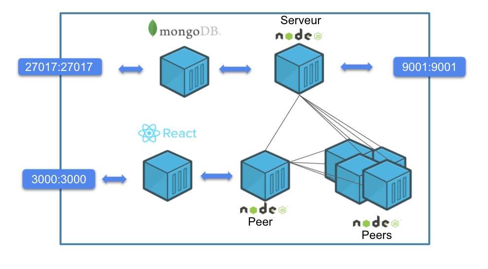

# Halgo Cryptocurrency 

## What is Halgo Cryptocurrency ?
Halgo Cryptocurrency is a proof of concept of crypto currency like Bitcoin. This Poc take over of the main concept of Cryptocurrency. Docker allows us to recreate a real environement of nodes in P2P network.

This project contains 4 sub-projects
> docker

It contains  all DockerFile for creating NodeJS and ReactJS

> front-blockchain

It contains a ReactJS application for interacting with one node. We can create a transaction for now.

> Node

It contains a NodeJS peers in P2P network. This application handle wallet, transactions and mining. 

> NodesServer

It is a Nodejs Server  to have node IP  address registering and sharing

## Installation

This project just need [Docker](https://docs.docker.com/get-docker/)

## Quick Start
Run the docker  command below for launching the cryptocurrency: 

    docker-compose up
Link below of web application:

[Create a transaction](http://localhost:3000/transaction)

[Blochain Exploreur](http://localhost:3000/blockchain)

## Architecture

## What's included?
- TypeScript
- NodeJS
- MongoDB
- ReactJS
## Supported Systems
Halgo Cryptocurrency  requires Docker, and currently only works on Windows, Mac and Linux.

	
| Mac        | Linux           | Windows  |
| ------------- |:-------------:| -----:|
| Install Docker on Mac| Install Docker on Ubuntu	| Install Docker on Windows|
|    | Install Docker on Debian      |    |
|  | Install Docker on CentOS     |     |

